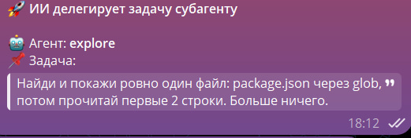
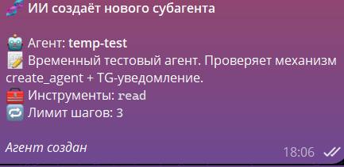

# Cookie Code 🍪

<p align="center">
  
</p>

<p align="center">
  <a href="https://github.com/merfiDEV/Cookie-code/releases/latest"></a>
  <a href="https://github.com/merfiDEV/Cookie-code/blob/master/LICENSE"></a>
  <a href="https://github.com/merfiDEV/Cookie-code"></a>
  <a href="https://github.com/merfiDEV/Cookie-code"></a>
</p>

<p align="center">
  <strong>English</strong> · <a href="README.ru.md">Русский</a>
</p>

<p align="center">
  
</p>

**Turn DeepSeek into a real coding assistant.** Cookie Code bridges the gap between AI chat and your actual codebase — no API tokens, no copy-paste, just pure automation.

---

## 🎯 Why Cookie Code?

**The Problem:** DeepSeek is smart, but blind to your project. It can't read files, run commands, or commit changes. You're stuck copy-pasting code back and forth.

**The Solution:** Cookie Code injects a local execution layer into the DeepSeek web chat:

✅ **Zero token cost** — uses your free DeepSeek web account, no API keys  
✅ **Real agent loop** — AI reads files → writes code → runs tests → commits changes  
✅ **Subagents** — AI delegates tasks to isolated agents (own context, own tool whitelist)  
✅ **Git integration** — see diffs, browse history, review changes in a visual panel  
✅ **Telegram control** — code from your phone, get notifications, approve commands remotely  
✅ **Beautiful UI** — glass effects, custom themes, animated pets, dark mode

---

## ✨ Key Features

### 🤖 **AI Agent That Actually Does Things**

The AI can now:

- 📖 **Read your files** — entire project structure, grep patterns, file contents
- ✏️ **Write & edit code** — create files, apply patches, delete old code
- 💻 **Run commands** — bash, PowerShell, database queries, any shell script
- 🔍 **Search & navigate** — find files by glob, search content with regex
- 📊 **Manage tasks** — create, track, and complete todo lists
- 🌐 **Fetch data** — HTTP requests, API calls, web scraping
- 🔧 **MCP tools** — connect any MCP server for extended capabilities
- 🧠 **Two-level memory** — AI remembers both you and the project: **global** memory (`<userData>/memory.md`) holds user/system facts, **project** memory (`<projectDir>/.cuckoo/memory/ProjectMemory.md`) holds conventions, architecture and key paths

**How it works:**

1. You ask: "Show me recent changes in auth.js"
2. AI emits: `` `cuckoo const r = await grep('auth.js', 'login');` ``
3. Cookie Code intercepts, executes, streams result back to AI
4. AI sees the output and continues working

### 🚀 **Subagents — AI Builds Its Own Helpers**

<p align="center">
  
  
</p>

Cookie Code can **delegate tasks to isolated AI agents**, each in its own window with its own context. The subagent's drafts, searches, and tool calls **never pollute the main conversation** — only the final summary comes back to the parent.

**How it works:**

1. You: _"Delegate to explore: find all calls to apiFetch"_
2. AI calls `run_agent("explore", "find all calls to apiFetch")`
3. A **separate window** opens using the same DeepSeek login
4. The subagent works in isolation: `glob → read → grep → ...`
5. When done, the window closes and **only the summary** appears in the chat

**Three ways to create an agent:**

- **Manually** — drop `cookie/agents/<name>.md` with frontmatter into your project
- **Via AI** — say _"Create an agent for SQL migration review"_ → AI calls `create_agent` and uses it immediately
- **Built-in** — `explore`, `code-reviewer`, `git-committer`, `changelog-writer` ship with the project

**Safety rails:**

- 🔒 **Tool whitelist** — put `tools: read, grep` in the agent's frontmatter → it **physically cannot** call `bash` or `mysql`
- 🚫 **Anti-recursion** — a subagent cannot spawn another subagent
- ⏱ **maxTurns** — breaks infinite loops (e.g., 40 steps for the committer)
- ⏲ **10-min timeout** — force-closes a hung window

**Agent example:**

```markdown
---
name: code-reviewer
description: Review code quality. Use after writing code.
tools: read, grep, glob
maxTurns: 20
---

You are an experienced code review expert...
```

---

### 🎨 **Beautiful & Customizable**

<p align="center">
  
</p>

- **Glass UI** — frosted glass panels with custom blur and opacity
- **27 wallpapers** — hand-picked backgrounds built-in
- **Animated pets** — cute mascots that react to your work
- **Dark/Light themes** — automatic or manual switching
- **Custom fonts** — bring your own typeface
- **RGB effects** — animated username glow

### 🔒 **Smart Safety Gates**

- **Tool approval** — confirm risky commands (bash, file writes) before execution
- **Dangerous patterns** — regex blacklist for commands you never want to run
- **Hidden service messages** — clean chat UI, but AI still sees full context
- **Session-based whitelist** — approve a tool once, it runs freely until reload

### 📱 **Telegram Bot Integration**

Control everything from your phone:

- `/status` — current project, active processes, todo count
- `/diff` — see uncommitted changes with syntax highlighting
- `/log` — browse git history, show commit diffs
- `/todos` — manage task list remotely
- `/screen` — take a screenshot of the active window
- `/stop` — kill runaway processes

**Incoming messages** → typed into chat automatically  
**Voice messages** → transcribed via local Whisper and sent to AI  
**Photos/files** → attached to the chat input field

### 🧠 **Two-Level Memory**

The AI remembers **both you and the project** — memory is split into two independent levels:

| Level     | Location                                       | What it remembers                                                      |
| --------- | ---------------------------------------------- | ---------------------------------------------------------------------- |
| 🌍 Global | `<userData>/memory.md`                         | User and system facts: name, OS, GPU, code style preferences           |
| 🗂 Project | `<projectDir>/.cuckoo/memory/ProjectMemory.md` | Conventions, architectural decisions, key paths, stack of this project |

- Tools `memorySave(text, scope?)`, `memoryRead(scope?)`, `memoryClear(scope?)` accept `scope`: `'project'` | `'global'` (`memoryRead` also `'all'`).
- By default `memorySave` writes to **project** memory if the project is initialized, otherwise to global.
- Absolute paths to both files are injected into the system prompt and exposed in JS scripts as `globalThis.memoryPath` and `globalThis.projectMemoryPath`.
- Files can be opened, cleared, and their stats viewed separately per level in **Settings → Cookie Code**.
- Project memory lives in `.gitignore` — the AI's personal notes are never committed.

### ⌨️ **Hotkeys**

| Key    | Action                                      |
| ------ | ------------------------------------------- |
| **F1** | Show the current CHANGELOG (What's New box) |

The What's New window (F1) is **draggable by its header** and adapts its width to the screen.

### 📊 **Git Integration**

<p align="center">
  
</p>

Built-in diff viewer:

- **Changes tab** — see uncommitted changes, file-by-file diffs
- **History tab** — browse commits, click to see full diff
- **Navigation** — jump between hunks, filter added/deleted lines
- **Mini-map** — visual overview of changes
- **Inline diff** — character-level highlighting for precise edits
- **Commit button** — stitches the unified diff of **all** changed files and posts a ready message to the chat asking to commit (you can summon the `git-committer` agent or commit yourself)

### 📈 **Statistics Dashboard**

Track your productivity:

- **Activity heatmap** — GitHub-style contribution graph
- **Token usage** — daily/weekly trends
- **Favorite models** — which AI you use most
- **Streak tracking** — longest consecutive days of coding

---

## 🚀 Quick Start

### Option 1: Download Binary (Recommended)

**Windows:**

1. Download [CookieCode-Setup.exe](https://github.com/merfiDEV/Cookie-code/releases/latest)
2. Run installer
3. Launch Cookie Code

**macOS:**

1. Download [CookieCode.dmg](https://github.com/merfiDEV/Cookie-code/releases/latest)
2. Drag to Applications
3. Open (right-click → Open if Gatekeeper blocks)

### Option 2: Build from Source

```bash
# Clone the repo
git clone https://github.com/merfiDEV/Cookie-code.git
cd Cookie-code

# Install dependencies
npm install

# Run in development mode
npm start

# Or build for your platform
npm run build:win      # Windows installer
npm run build:mac      # macOS .dmg
```

**Requirements:** Node.js 16+ (18+ recommended)

---

## 📖 How to Use

### 1️⃣ **First Launch**

On first run, Cookie Code opens the DeepSeek chat and shows a setup wizard:

1. **Pick a project directory** — this is your working folder
2. **Choose a theme** — wallpaper, glass effects, pet
3. **(Optional)** Set up Telegram bot for remote control

### 2️⃣ **Start Coding**

Just chat naturally with the AI:

```
You: "Review the changes I made today"
AI: Let me check... [runs git diff]
    You modified 3 files: auth.js, api.js, README.md
    [shows inline diff blocks]

You: "Write tests for the login function"
AI: [reads auth.js, creates auth.test.js, runs npm test]
    ✅ All 5 tests passing

You: "Commit this with a good message"
AI: [runs git add + git commit]
    Committed: "feat(auth): add comprehensive login tests"
```

### 3️⃣ **Explore Tools**

Open the side panel (Cookie Code logo) to:

- 🗂️ **Browse sessions** — switch between project contexts
- 📝 **Manage todos** — see AI-created task lists
- 🔄 **View git diff** — visual file changes
- ⚙️ **Adjust settings** — themes, tools, Telegram

---

## 🎓 Advanced Features

### Project-Wide Context (Coming Soon)

**Current limitation:** AI only knows files it explicitly reads.

**Planned feature:** Full project indexing

- Embed all source files into a vector database
- AI can semantic search: "Where's the auth logic?"
- Instant jump-to-definition for any symbol
- RAG (Retrieval-Augmented Generation) for better answers

### MCP Server Support

Connect any [Model Context Protocol](https://modelcontextprotocol.io) server:

```json
{
  "mcpServers": {
    "github": {
      "command": "npx",
      "args": ["-y", "@modelcontextprotocol/server-github"],
      "env": { "GITHUB_TOKEN": "..." }
    }
  }
}
```

Now AI can create PRs, review code, manage issues — all through natural language.

### Custom Tool Scripts

Drop `.js` files into `tools/custom/` to extend Cookie Code:

```javascript
// tools/custom/deploy.js
module.exports = {
  name: "deploy",
  description: "Deploy to production",
  params: { target: "string" },
  async execute({ target }) {
    // Your deployment logic
    return { success: true, url: "..." };
  },
};
```

AI can now call `deploy` like any built-in tool.

---

## 🛠️ Built-in Tools

Cookie Code ships with 20+ tools out of the box:

| Tool        | Description              | Example                                 |
| ----------- | ------------------------ | --------------------------------------- |
| `read`      | Read file contents       | `read('src/auth.js')`                   |
| `write`     | Create or overwrite file | `write('test.js', code)`                |
| `edit`      | Apply targeted patch     | `edit('app.js', oldCode, newCode)`      |
| `glob`      | Find files by pattern    | `glob('**/*.test.js')`                  |
| `grep`      | Search file contents     | `grep('TODO', { include: '*.js' })`     |
| `bash`      | Run shell command        | `bash('npm test')`                      |
| `pwsh`      | Run PowerShell script    | `pwsh('Get-Process')`                   |
| `git`       | Git operations           | `git('status')`                         |
| `mysql`     | SQL queries              | `mysql('SELECT * FROM users')`          |
| `webFetch`  | HTTP requests            | `webFetch('https://api.example.com')`   |
| `todoWrite` | Manage task lists        | `todoWrite([{content: 'Fix bug'}])`     |
| `mcpCall`   | Call MCP server tool     | `mcpCall('github', 'create_pr', {...})` |

[Full tool reference →](docs/TOOLS.md)

---

## 🎨 Customization

### Themes

**Settings → Cookie Code → Theme & Glass**

- **Background blur** — 0-30px frosted glass effect
- **Panel opacity** — 0-100% transparency
- **Glass colors** — custom hex colors for panels
- **Button styles** — border radius, hover effects

### Pets

**Settings → Cookie Code → Pets**

Drop PNG/GIF files into `userData/pets/`, pick from grid. Animated pets react to tool execution success/failure.

### Fonts

**Settings → Cookie Code → Font**

Drop `.ttf`/`.otf`/`.woff` files into `userData/fonts/`, select from dropdown. Applies to entire UI.

---

## 🤝 Contributing

We welcome contributions! Here's how:

1. **Fork** the repo
2. **Create a branch** — `git checkout -b feature/amazing-feature`
3. **Make changes** — add features, fix bugs, improve docs
4. **Test** — `npm test` (402 tests, 100% critical path coverage)
5. **Commit** — `git commit -m 'feat: add amazing feature'`
6. **Push** — `git push origin feature/amazing-feature`
7. **Open PR** — describe what changed and why

### Areas We Need Help

- 🌍 **Translations** — add more languages to `src/preload/i18n/`
- 📚 **Documentation** — improve guides, add video tutorials
- 🐛 **Bug reports** — test on different systems, report edge cases
- ✨ **New tools** — implement tool ideas from the [wishlist](https://github.com/merfiDEV/Cookie-code/issues?q=is%3Aissue+is%3Aopen+label%3Aenhancement)

---

## 📜 License

MIT License — see [LICENSE](LICENSE) for details.

Free to use, modify, and distribute. Commercial use allowed.

---

## 🙏 Credits

Built with:

- [Electron](https://www.electronjs.org/) — desktop app framework
- [DeepSeek](https://www.deepseek.com/) — AI chat interface
- [Telegraf](https://github.com/telegraf/telegraf) — Telegram bot framework
- [gifenc](https://github.com/mattdesl/gifenc) — GIF processing

Inspired by:

- [Aider](https://github.com/paul-gauthier/aider) — AI pair programming in terminal
- [Claude Desktop](https://claude.ai/download) — MCP protocol pioneer
- [Cursor](https://cursor.sh/) — AI-first code editor

---

## ⭐ Star History

[](https://star-history.com/#merfiDEV/Cookie-code&Date)

If Cookie Code saves you time, consider giving it a star! It helps others discover the project.

---

## 🔗 Links

- **Documentation:** [docs/](docs/)
- **Changelog:** [CHANGELOG.md](CHANGELOG.md)
- **Roadmap:** [GitHub Projects](https://github.com/merfiDEV/Cookie-code/projects)
- **Discord:** [Join the community](https://discord.gg/...) _(coming soon)_
- **Twitter:** [@CookieCodeAI](https://twitter.com/...) _(coming soon)_

---

<p align="center">
  Made with 🍪 by developers, for developers
</p>
