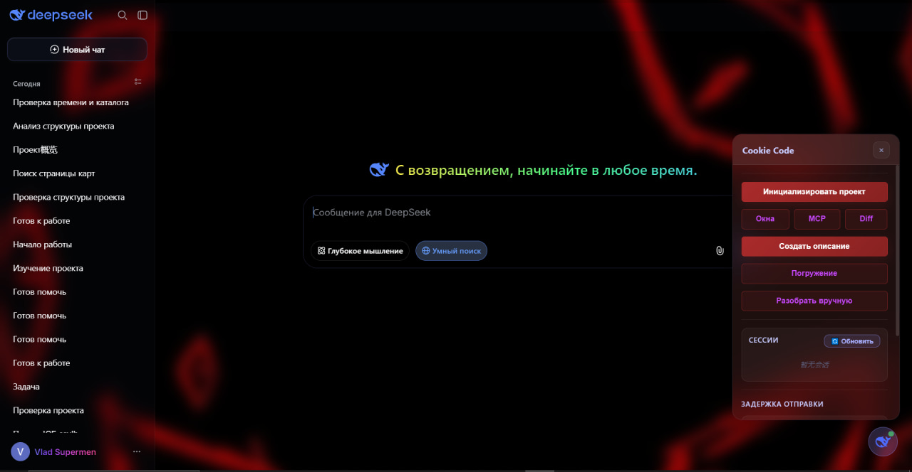

# Cookie Code

<p align="center">
  <a href="https://github.com/merfiDEV/Cookie-code/releases/latest"></a>
  <a href="https://github.com/merfiDEV/Cookie-code/blob/master/LICENSE"></a>
  <a href="https://github.com/merfiDEV/Cookie-code"></a>
  <a href="https://github.com/merfiDEV/Cookie-code"></a>
  <a href="https://github.com/merfiDEV/Cookie-code"></a>
</p>

<p align="center">
  <a href="README.md">English</a> · <strong>Русский</strong>
</p>

**Cookie Code** — AI-агент для рабочего стола с **нулевой стоимостью токенов**.

Приложение встраивает веб-чат DeepSeek в нативное окно Electron, добавляет боковой оверлей и превращает чат в локальный исполнитель: AI генерирует вызовы инструментов (блоки JavaScript-кода), которые перехватываются, подтверждаются, выполняются в локальной песочнице и стримятся обратно в чат. Никакого API-ключа, никакой оплаты за токены — вы используете обычный веб-аккаунт.

---

## Зачем это нужно

Веб-чаты прекрасно **думают**, но не могут **действовать** на вашей машине. Cookie Code замыкает этот цикл:

- **Нулевая стоимость токенов** — всё идёт через веб-интерфейс DeepSeek, без API.
- **Настоящий агентный цикл** — Думай → Действуй → Наблюдай → Повторяй. Работа с файлами, поиск по коду, shell-команды, запросы к БД, MCP-инструменты.
- **Нативная оболочка** — Electron-обёртка с собственным оверлеем, темами и настройками.

---

## Возможности

### Выполнение инструментов

- AI отправляет вызовы инструментов в виде блоков JavaScript (```cuckoo).
- Каждый вызов перехватывается, показывается в оверлее и выполняется в песочнице Node.
- Результаты автоматически стримятся в чат как системное сообщение.
- Ненулевой код выхода shell (`[exit code: N]`) подсвечивается красным под соответствующим блоком.

### Инлайн tool-блоки

Каждый `cuckoo`-блок в чате превращается в раскрывающуюся карточку:

- Иконка ▼ + название инструмента (Read / Write / Edit / Bash / Glob / Grep / PowerShell / Todo / WebFetch / MCP / MySQL / …)
- Подсказка файла из первого аргумента
- Клик — развернуть/свернуть
- **Красный стиль + иконка ⚠** при ошибке выполнения

Стили сохраняются после перезагрузки страницы — восстанавливаются из `localStorage`.

### Мета ответа

Под каждым ответом AI появляется автоматический бейдж:

```
⏱ 5.2s · ~380 tok
```

- **Реальное время** ответа (от начала стрима до завершения)
- **Оценка токенов** (`символы / 4`) — приблизительная
- Сохраняется в `localStorage`, восстанавливается после перезагрузки

### Фоны

- **27 вручную отобранных обоев** в комплекте
- Выбор через сетку превью в **Настройки → Cookie Code**
- Смена мгновенная, без перезагрузки

### Блюр и прозрачность

Полный контроль над стеклянным эффектом интерфейса:

- Блюр фонового изображения (0–30 px)
- Блюр шапки и сайдбара
- Прозрачность шапки / сайдбара / tool-блоков
- Стекло tool-блоков

Все настройки сохраняются в `cuckoo-settings.json`.

### RGB-ник

Ник пользователя в сайдбаре имеет **анимированный радужный градиент** (включено по умолчанию). Отключается в **Настройки → Cookie Code → Эффекты**.

### Telegram-бот

Управляйте Cookie Code и следите за ним с телефона:

<p align="center">
  
  <br>
  
  
</p>

- **Уведомления об инструментах** — каждый вызов (успех/ошибка, имя, аргументы, результат) приходит в ваш Telegram-чат. Для `edit` показывается новый код (до 2000 символов).
- **Ответы AI** — каждый текстовый ответ AI дублируется в Telegram (человекочитаемый текст без code-блоков).
- **Входящие сообщения** — напишите боту, и сообщение попадёт в чат DeepSeek, как если бы вы набрали его сами.
- **Команда `/todos`** — список задач активного окна прямо из Telegram.
- **`/help`** — полная справка по командам бота.
- **`/settings`** — интерактивное меню настроек с inline-кнопками. Все опции Cookie Code редактируются с телефона: внешний вид (кастомизация, RGB-ник, язык UI), стекло и панель (размытие, прозрачность, ширина, цвета), агент и приватность (режим подтверждения, скрытие служебных сообщений, авто-форматтеры, файловые чипы, затронутые файлы, список опасных паттернов), а также сам Telegram-бот (токен, chat ID, тумблеры уведомлений). Обои сознательно исключены.
- **`/cancel`** — отменить ожидающий ввод значения.
- Лёгкий клиент **без зависимостей** (long-polling, без VPS и webhook).
- Настройка в **Настройки → Cookie Code → Telegram-бот** (токен от @BotFather + chat ID) или прямо из Telegram через `/settings`.

### Чистое окно

Без системного меню Electron — приложение сразу открывается в DeepSeek. Все стандартные горячие клавиши (Ctrl+C/V, Ctrl+R, F12) работают.

### Инициализация проекта

Выберите каталог проекта один раз — AI получит дерево каталога и системный промпт, адаптированный к реальному проекту. Все дальнейшие вызовы инструментов разрешают пути относительно этого каталога.

### Поддержка MCP

Формат конфигурации, совместимый с Claude Desktop. Поддерживаются MCP-серверы `stdio` и `http` типов. Управление серверами и инструментами — из оверлея.

### Скиллы

Поместите папку в `.cuckoo/skills/<name>/` с файлом `SKILL.md` (и опциональным `tool.js`) — она станет вызываемой через `skillList`, `skillLoad`, `skillExecute`.

### Авто-форматтеры

Каждый `write` и `edit` прогоняет файл через форматтер для конкретного языка — код AI автоматически приводится к стилю вашего проекта. Не нужно вручную запускать `prettier --write`, стиль не мешает в diff.

Встроенные форматтеры:

| Форматтер | Для чего | Что нужно |
|-----------|----------|-----------|
| `prettier` | `.js .jsx .ts .tsx .json .css .md .yaml` … | `prettier` в ближайшем `package.json` + бинарь в `node_modules/.bin` или `PATH` |
| `biome` | то же, что prettier | `biome.json` / `biome.jsonc` в проекте |
| `gofmt` | `.go` | `gofmt` в `PATH` |
| `ruff` | `.py .pyi` | `ruff` в `PATH` + `[tool.ruff]` в `pyproject.toml` (или `ruff.toml`) |
| `rustfmt` | `.rs` | `rustfmt` в `PATH` |
| `shfmt` | `.sh .bash` | `shfmt` в `PATH` |
| `clang-format` | `.c .cpp .h` … | конфиг `.clang-format` + `clang-format` в `PATH` |

- Определение **учитывает конфиг проекта**: ruff не запустится без `[tool.ruff]`, prettier — без зависимости в `package.json`. Никакого неожиданного форматирования чужого кода.
- Ошибки форматтера глушатся — падение форматтера никогда не блокирует `write`/`edit`.
- Отключается через `"formattersEnabled": false` в `cuckoo-settings.json`.

### Персистентность сессии

Логин, проекты и настройки хранятся в `%APPDATA%/cuckoo-ai-pro-session` (Windows) или аналогичном пути userData на macOS/Linux.

---

## Установка

### Требования

- Node.js >= 16.0.0
- npm

### Из исходников

```bash
# Клонировать
git clone https://github.com/merfiDEV/Cookie-code.git
cd Cookie-code

# Установить зависимости
npm install

# Если npm блокирует postinstall electron (allowScripts), одобрить:
#   npm install-scripts ls
#   npm install-scripts approve electron
#   npm install

# Запустить
npm start
```

### Сборка

```bash
# Установщик Windows (NSIS)
npm run build:win

# Portable
npm run build:win:portable

# macOS DMG
npm run build:mac:dmg
```

---

## Использование

1. Запустите приложение — оно сразу откроется в DeepSeek.
2. Войдите в свой аккаунт DeepSeek.
3. Нажмите **«Инициализировать проект»** и выберите каталог. Теперь AI имеет доступ к дереву и системному промпту.
4. Общайтесь с AI. Попросите отредактировать файлы, выполнить команды, найти что-то в коде.
5. Вызовы инструментов в ответе AI перехватываются, показываются в оверлее и выполняются.
6. Результаты автоматически отправляются обратно AI, цикл продолжается.

### Пример вызова инструмента

AI генерирует блок вида:

````markdown
```cuckoo
const content = await read("src/index.js");
log(content);
```
````

Cookie Code перехватывает его, выполняет в песочнице и возвращает результат AI.

---

## Доступные инструменты

| Инструмент | Описание |
|-----------|----------|
| `read`, `readLines` | Чтение файлов (с номерами строк, offset/limit) |
| `write`, `edit` | Создание / изменение файлов (авто-форматирование при сохранении — см. ниже) |
| `deleteFile` | Удаление файла |
| `glob`, `grep` | Поиск по файлам (на базе ripgrep) |
| `bash`, `pwsh` | Выполнение команд |
| `todoWrite` | Структурированный список задач |
| `webFetch` | Загрузка HTTP(S) как Markdown |
| `mysql` | SQL-запросы |
| `mcpCall`, `mcpListServers`, `mcpGetTools` | MCP-инструменты |
| `skillList`, `skillLoad`, `skillExecute` | Пользовательские скиллы |
| `openBrowserWindow`, `injectJS` | Окно браузера Electron + инъекция JS |

Полные TypeScript-декларации — в `tools/cuckoo-tools.d.ts`.

---

## Кастомизация

Cookie Code создан для того, чтобы его перестраивать: меняйте обои, настраивайте стеклянный эффект, задавайте акцентный цвет, пишите собственные скиллы или расширяйте набор инструментов.

<p align="center">
  
  <br>
  
  <br>
  
</p>

### Внешний вид

Всё визуальное живёт в **Настройки → Cookie Code** и сохраняется в `cuckoo-settings.json`:

- **Фоны** — 27 встроенных обоев, либо положите своё изображение в `src/ui/backgrounds/` и зарегистрируйте его в `registry.json`.
- **Стеклянный эффект** — размытие фона / шапки / сайдбара, прозрачность и размытие стекла tool-блоков.
- **RGB-никнейм** — анимированный радужный градиент в сайдбаре, переключается в разделе **Effects**.

### Пользовательские скиллы

Добавьте собственный вызываемый скилл, не трогая код приложения:

```
.cuckoo/skills/<skill-name>/
├── SKILL.md    # инструкции для AI
└── tool.js     # опциональные экспортируемые функции
```

AI получает к нему доступ через `skillList`, `skillLoad` и `skillExecute`.

### Пользовательские инструменты

Реализации инструментов лежат в `tools/` и работают в главном процессе. Добавьте функцию, объявите её в `tools/cuckoo-tools.d.ts` — и AI сможет вызывать её как любой встроенный инструмент.

### Провайдер

Адаптер DeepSeek находится в `src/providers/deepseek.js` — форкните его, чтобы подключить Cookie Code к другой платформе веб-чата.

---

## Безопасность

- Опциональный гейт подтверждения tool-вызовов (off / risky / all) — настраивается в приложении или через Telegram `/settings`
- Таймаут команды 30 с, таймаут песочницы 60 с
- Буфер вывода 1 МБ
- Редактируемый блэклист опасных команд (rm -rf /, format, diskpart, …) — regex-паттерны, меняются прямо в настройках или через Telegram
- Авто-форматтеры запускаются только когда этого требует конфиг проекта (конфиг-осознанное определение) и никогда не блокируют `write`/`edit`
- Пути файлов ограничены каталогом проекта

---

## Конфигурация

Настройки хранятся в `cuckoo-settings.json` в userData-каталоге приложения:

```json
{
  "background": "miku",
  "backgroundBlur": 0,
  "headerBlur": 12,
  "sidebarBlur": 12,
  "headerOpacity": 45,
  "sidebarOpacity": 45,
  "toolBlockOpacity": 55,
  "toolBlockBlur": 0,
  "rgbUsername": true,
  "formattersEnabled": true,
  "fileChipEnabled": true,
  "showProducedFiles": true,
  "language": "ru",
  "telegramEnabled": false,
  "telegramBotToken": "",
  "telegramChatId": "",
  "telegramNotifyTools": false,
  "telegramChatFeed": false
}
```

Все настройки редактируются через **Настройки → Cookie Code**.

---

## Структура проекта

```
src/
├── main/            Главный процесс Electron
│   ├── index.js         Точка входа, создание окон
│   ├── ipc.js           IPC-обработчики
│   ├── settings-store   Пользовательские настройки
│   ├── profile-manager  Профили окон
│   ├── session-store    Сессия ↔ каталог проекта
│   ├── mcp-client       Интеграция MCP SDK
│   ├── skill-manager    Загрузка скиллов
│   ├── format-registry  Встроенные форматтеры (prettier/biome/gofmt/ruff/...)
│   ├── formatter        Авто-формат после write/edit
│   ├── window.js        Реестр окон
│   └── ...
├── preload/
│   ├── api.js           contextBridge → electronAPI
│   ├── index.js         Инициализация
│   ├── i18n/
│   │   └── i18n.js          RU/EN-переводы, хелпер `t(key, params)`
│   ├── dom/             Парсеры DOM и observers
│   │   ├── observer.js       Основной observer реплик
│   │   ├── tool-render.js    Инлайн tool-блоки
│   │   ├── response-meta.js  Бейдж ⏱ под ответом
│   │   ├── settings-tab.js   Вкладка Cookie Code в настройках
│   │   ├── background.js     Обои и блюр
│   │   └── ...
│   └── overlay/         Оверлей-панель
│       ├── template.js       buildOverlayHTML() + OVERLAY_CSS
│       ├── diff-panel.js     Панель «Изменения» (git) / «История»
│       └── todo-panel.js     Плавающий список задач
├── providers/
│   └── deepseek.js      Адаптер платформы
├── ui/
│   ├── backgrounds/     27 обоев + registry.json
│   └── logos/
tools/                 Реализация инструментов (в главном процессе)
└── cuckoo-tools.d.ts  TypeScript-декларации для AI
botsrc/                Интеграция Telegram-бота (без зависимостей)
├── telegram.js          Клиент Telegram (long-polling)
└── index.js             Настройки, уведомления, приём сообщений
```

---

## Лицензия

[MIT](LICENSE)
